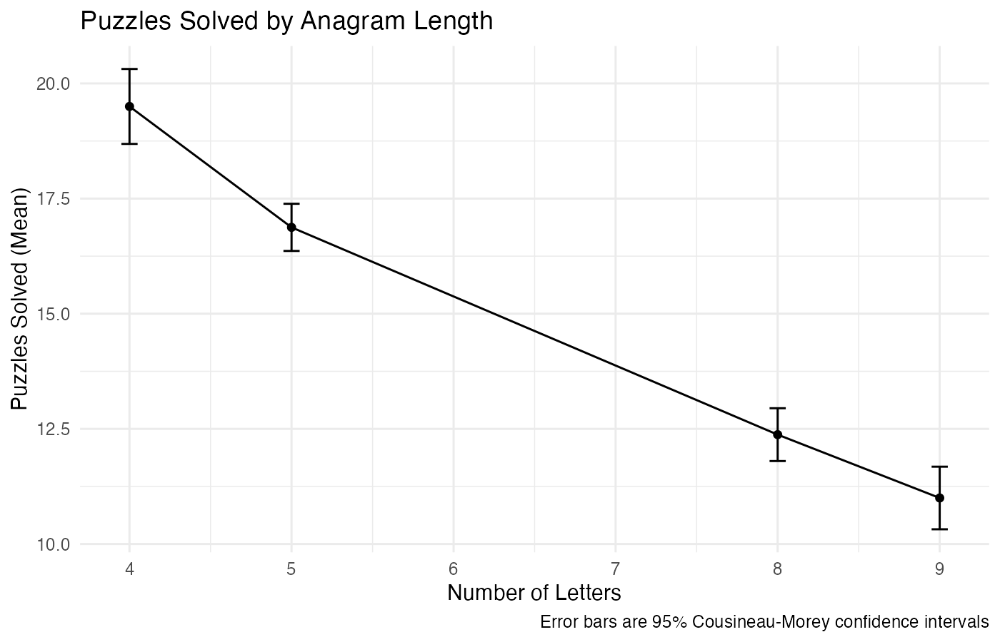

# Lab 10 — Anagram Difficulty (Repeated Measures)

High‑signal workflow for a within‑subjects ANOVA with Cousineau‑Morey CIs and a planned linear trend contrast. This repo folder includes a full key, a clean final Rmd, a reproducible script, and knitted outputs.

## Research Question
Do participants solve fewer anagrams as the number of letters increases (4, 5, 8, 9 letters)?

## Data
Manually entered from the provided table in the assignment doc.

- **Subjects:** 8
- **Outcome:** number of puzzles solved
- **Within‑subject factor:** anagram length (4/5/8/9 letters)

## Analyses
- Wide → long reshape
- Summary stats + Shapiro‑Wilk per condition
- Within‑subject ANOVA (GG correction)
- Cousineau‑Morey confidence intervals
- Line plot with CM error bars
- Linear trend contrast with Scheffé adjustment

## Key Outputs
- **Key Rmd (syntax + output):** `lab10_output/lab_10_key.Rmd`
- **Key docx (knit):** `lab10_output/lab_10.docx key.docx`
- **Final Rmd (clean):** `lab10_output/lab_10_final.Rmd`
- **Solution HTML (knit):** `lab10_output/lab_10_solution.html`
- **Script:** `lab10_output/lab_10_script.R`

## Visuals

## Quick Run
1. Set your working directory to the Lab10 folder.
2. Confirm `baguley.txt` is in the same folder.
3. Knit `lab10_output/lab_10_key.Rmd` (Word key) or `lab10_output/lab_10_solution.Rmd` (HTML).

## Notes
- Error bars are 95% Cousineau‑Morey CIs.
- Linear trend is negative and significant after Scheffé adjustment.
