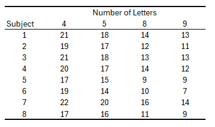

```{r setup, include=FALSE}
knitr::opts_chunk$set(echo = TRUE, message = FALSE, warning = FALSE)

root_dir <- "/Users/dannyzweben/Desktop/GradClass/Y1/S2/StatsII/StatsII-Labs/Lab10"
knitr::opts_knit$set(root.dir = root_dir)
setwd(root_dir)

library(tidyverse)
library(afex)
library(pastecs)
library(emmeans)
source("baguley.txt")

# Fix for environments where `$` on data.frame returns a data.frame
if (inherits(data.frame(Subject = 1)$Subject, "data.frame")) {
  assign("$.data.frame", function(x, name) x[[name]], envir = .GlobalEnv)
}
```

You are analyzing data from an experiment where subjects were given a random mix of anagrams at four levels of difficulty, represented by the number of letters in the anagram.  The dependent variable is the number of puzzles solved by each participant.



# Problem 1 (0 pts)

Download the `baguley.txt` file from Canvas.  This contains the code to create Cousineau-Morey confidence intervals.  In your R session, set your working directory to wherever you downloaded the file.

# Problem 2 (0 pts)

Load these packages into memory: `afex`, `pastecs`, `tidyverse`.  Also load the baguley.txt file into memory using the `source` command.

```{r}
library(afex)
library(pastecs)
library(tidyverse)
source("baguley.txt")
```

# Problem 3 (1 pt)

Read the data into R as a wide dataframe.  Please note that variable names in R cannot start with a number, they have to start with an alphabetical character.  Also note that in order to get the repeated-measures ANOVA to work in R you will also need to enter the ID variable.  **Print the data frame.**

```{r}
wid <- data.frame(
  Subject = 1:8,
  L4 = c(21, 19, 21, 20, 17, 19, 22, 17),
  L5 = c(18, 17, 18, 17, 15, 14, 20, 16),
  L8 = c(14, 12, 13, 14, 9, 10, 16, 11),
  L9 = c(13, 11, 13, 12, 9, 7, 14, 9)
)
wid
```

# Problem 4 (2 pts)

Create a new data frame that is the “long” version of this one.  **Print the long data frame to ensure you did this correctly.**

```{r}
long <- pivot_longer(wid, cols = c("L4", "L5", "L8", "L9"),
                     names_to = "letters",
                     values_to = "solved")
long <- as.data.frame(long)
long
```

# Problem 5 (1 pt)

Overwrite the condition variable to be a factor variable.

```{r}
long$letters <- factor(long$letters)
```

# Problem 6 (6 pts)

In the long dataframe, create a **new** version of the condition variable that is a numerical variable.  You can use either `ifelse` or `substr` to do this.  Produce a two-way table (with `exclude` set to `NULL`) showing the version was generated correctly.  You may have to coerce the resulting variable to be numeric (`as.numeric`).  Use `is.numeric` to make the generated variable is numeric.

```{r}
long$letters_num <- as.numeric(substr(as.character(long$letters), 2, 2))

table(long$letters, long$letters_num, exclude = NULL)

is.numeric(long$letters_num)
```

# Problem 7 (2 pts)

Use either the wide or long dataframes to get means, standard deviations, and the Shapiro-Wilk test for each level.  If you use the wide dataframe, this is simply a matter of using `pastecs::stat.desc(,norm=T)` to get summary statistics for all variables in the data.  If you use the long data frame, use `tapply` and `pastecs::stat.desc` to get summary statistics for each level.

```{r}
pastecs::stat.desc(wid[, c("L4", "L5", "L8", "L9")], norm = TRUE)
```

# Problem 8  (1 pt)

Have R carry out the within-subject ANOVA.

```{r}
model <- aov_car(solved ~ letters + Error(Subject/letters), data = long)
summary(model)
```

# Problem 9 (5 pts)

Based on the output for the last two problems, how well does this conform to the assumptions of normality and sphericity?

Normality appears acceptable: Shapiro-Wilk tests are all nonsignificant (L4 W = 0.919, p = .424; L5 W = 0.977, p = .946; L8 W = 0.977, p = .945; L9 W = 0.932, p = .537). Sphericity is not violated (Mauchly’s test W = 0.664, p = .803), though GG epsilon is 0.781, so reporting GG-adjusted df is appropriate.

# Problem 10 (1 pt)

Create a subsetted version of the wide dataframe that just contains the four condition variables (no ID variable!)

```{r}
wid_sub <- subset(wid, select = c(L4, L5, L8, L9))
```

# Problem 11 (2 pts)

Use the `cm.ci` command from `baguley.txt` to crate the Cousineau-Morey confidence intervals (based on the subsetted wide dataframe), and save them to a new condition-level dataframe.  Print the dataframe.

```{r}
cm <- as.data.frame(cm.ci(data.frame = wid_sub,
                          conf.level = .95,
                          difference = FALSE))
cm
```

# Problem 12 (1 pt)
Create a condition variable in the Cousineau-Morey dataframe you just created.  This should have the exact same name as the condition factor variable you created.

```{r}
cm$letters <- rownames(cm)
```

# Problem 13 (1 pt)

Create yet another condition-level dataframe with the mean values of puzzles solved.  You should use both the **numeric** and **factor** version of the condition variable

```{r}
long <- group_by(long, letters_num, letters)
means <- summarize(long, mean_solved = mean(solved, na.rm = TRUE))
means
```

# Problem 14 (5 pts) 

Use `merge` to merge the Cousineau-Morey dataframe and the mean dataframe.  Print the resulting dataframe.  **Be sure that the merging took place without error–the means should be equidistant between the lower and upper bounds.**

```{r}
plot_df <- merge(means, cm, by = "letters")
plot_df
```

# Problem 15 (5 pts)

Graph the means and their error bars.  Use a professional-looking line graph, with a title and labels for the x- and y-axes. Add a note making clear what the error bars are.

```{r, fig.cap="Puzzles solved by number of letters"}
plot_obj <- ggplot(data = plot_df, aes(x = letters_num, y = mean_solved, group = 1)) +
  geom_line() +
  geom_errorbar(aes(ymin = lower, ymax = upper), width = 0.1) +
  geom_point() +
  labs(title = "Puzzles Solved by Anagram Length",
       x = "Number of Letters",
       y = "Puzzles Solved (Mean)",
       caption = "Error bars are 95% Cousineau-Morey confidence intervals") +
  theme_minimal()
plot_obj
```

# Problem 16 (2 pts)

Calculate the new numerator and denominator degrees of freedom by multiplying the ones listed in the ANOVA output by the Greenhouse-Geiser epsilon.

```{r}
a <- 4
n <- 8
num_df <- a - 1
den_df <- (n - 1) * (a - 1)
epsilon <- 0.78082
num_df_adj <- num_df * epsilon
den_df_adj <- den_df * epsilon
num_df_adj
den_df_adj
```

Optional (pull epsilon directly from the ANOVA table):

```{r eval=FALSE}
# sum_model <- summary(model)
# epsilon <- as.numeric(sum_model[["pval.adjustments"]]["letters", "GG eps"])
# num_df_adj <- num_df * epsilon
# den_df_adj <- den_df * epsilon
# num_df_adj
# den_df_adj
```

# Problem 17 (5 pts)

Write a brief summary of the omnibus F-test (one sentence maximum).

The Greenhouse-Geisser–adjusted omnibus test was significant, F(2.34, 16.40) = 202.86, p < .001.

# Problem 18 (1 pt)

Have `emmeans` produce an `emmgrid` object with the condition means.

```{r}
em <- emmeans(model, ~ letters)
em
```

# Problem 19 (3 pts) 

You are going to carry out a complex contrast to do a linear trend analysis, to see if there is a linear relationship between the “doses” of letters and puzzles solved.  

Assemble a vector with these contrast coefficients: -2.5,-1.5,1.5, and 2.5.  Put the vector in a list, and carry out the contrast.

By the way, if you are curious why these contrast coefficients, the formula for contrast coefficients for a linear trend is:

$X-\overline{X}$

where $X$ is the dosage level (here, 4,5,8,9 letters), and $\overline{X}$ is the mean dosage level (here 6.5 letters). 

```{r}
lin <- c(-2.5, -1.5, 1.5, 2.5)
lin_list <- list(lin)
contrast(em, lin_list)
```

# Problem 20 (1 pt)

Pretend the linear trend analysis was decided upon after looking at the data (in all likelihood, such an analysis would have been decided upon when the design was being planned, not afterwards).  Calculate the Scheffe-adjusted critical value for the contrast.

```{r}
a <- 4
n <- 8
alpha <- 0.05
scheffe_t <- sqrt((a - 1) * qf(1 - alpha, (a - 1), (n - 1)))
scheffe_t
```

# Problem 21 (5 pts)

Write up the trend analyses assessing significance using the Scheffe adjustment. Be sure to indicate the direction of the effect (ie positive or negative, regardless if it is significant or not). Effect sizes are not necessary.

The linear trend was negative (fewer puzzles solved as letter count increased) and significant after the Scheffe adjustment, t(7) = -22.59, p < .001.
