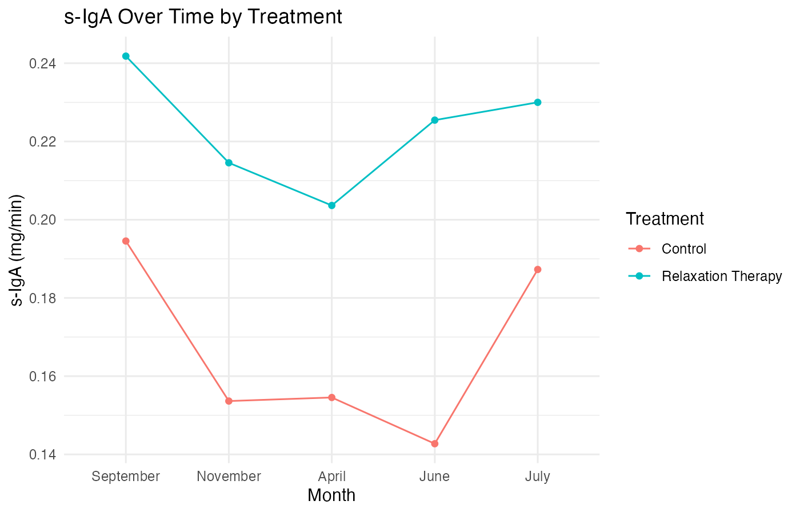
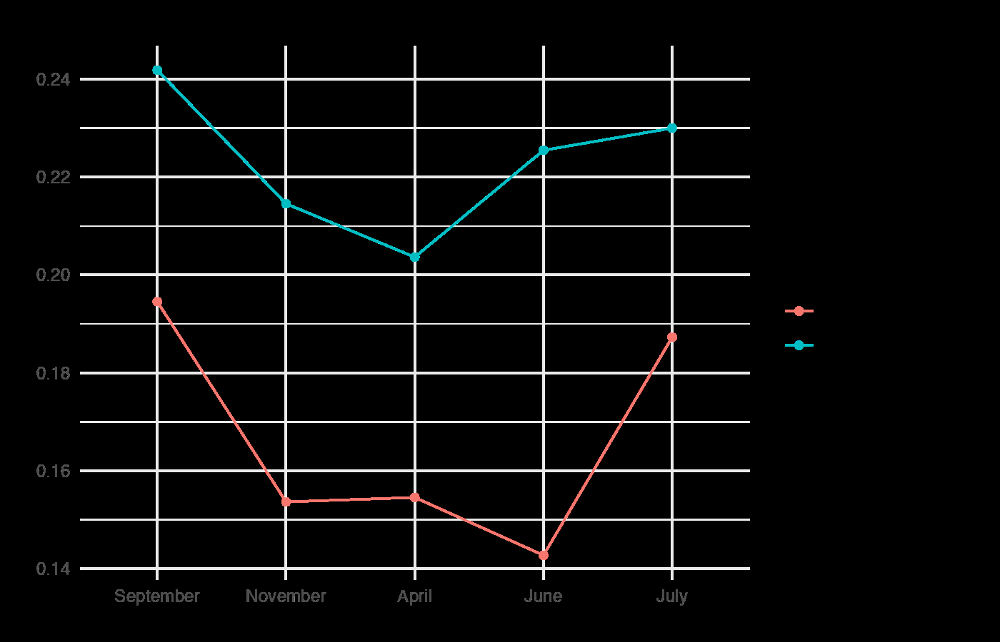

# Lab 12 — Relaxation Therapy & Stress Across the Academic Year

A clean, reproducible split‑plot workflow that tracks s‑IgA across five months for Control vs Relaxation Therapy groups. This folder includes a full key (syntax + output), a clean final Rmd, a reproducible script, and knitted deliverables.

## Research Question
Do relaxation techniques buffer stress across the semester (as indexed by s‑IgA), and do low‑stress vs high‑stress months differ by treatment?

## Data
`relax.rda` (already prepared) with repeated measures for:
- **Months:** September, November, April, June, July
- **Groups:** Control vs Relaxation Therapy
- **Outcome:** s‑IgA secretion rate (mg/min)

## Analyses
- Wide → long reshape
- Split‑plot ANOVA (month × treatment)
- Marginal & cell means via `emmeans`
- Cell‑means line plot
- Post‑hoc contrasts (low‑stress vs high‑stress)
- d~av~ using pooled SD from between‑subjects approximation

## Key Outputs
- **Key Rmd (syntax + output):** `lab12_output/lab_12_key.Rmd`
- **Key docx (knit):** `lab12_output/lab_12.docx key.docx`
- **Final Rmd (clean):** `lab12_output/lab_12_final.Rmd`
- **Solution HTML (knit):** `lab12_output/lab_12_solution.html`
- **Script:** `lab12_output/lab_12_script.R`

## Visuals

## Quick Run
1. Set your working directory to the Lab12 folder.
2. Confirm `relax.rda` is present.
3. Knit `lab12_output/lab_12_key.Rmd` (Word key) or `lab12_output/lab_12_solution.Rmd` (HTML).
