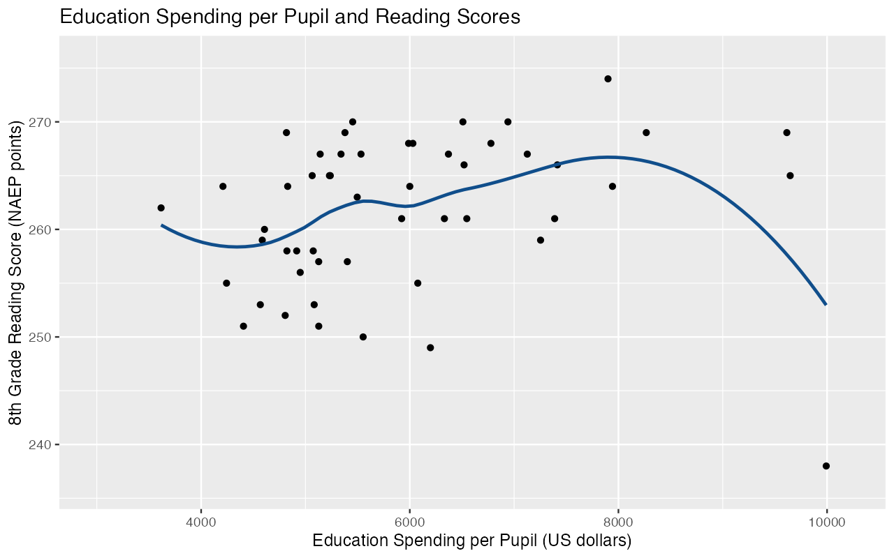
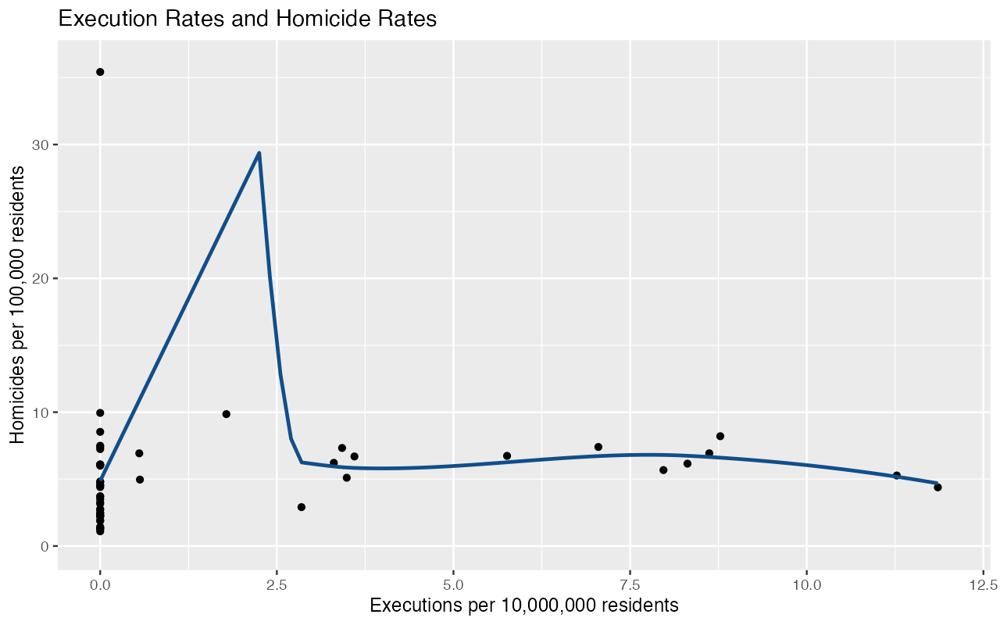
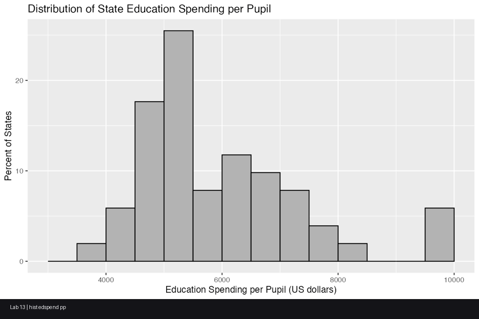

# Lab 13 — State-Level Correlation Diagnostics (2005)

> Robust correlations with transparent diagnostics, publication-style reporting, and reproducible outputs.

## Research Question
How are state-level outcomes associated in 2005 across U.S. states + D.C.?

1. Is higher **education spending per pupil** associated with higher **8th-grade reading scores**?
2. Are higher **execution rates** associated with higher **homicide rates**?

## Data + Design
- Data file: `stdata_v2.rda`
- Unit of analysis: state (N = 51)
- Derived rates:
  - `edspend_pp`: education spending per pupil (USD)
  - `execrate_10m`: executions per 10,000,000 residents
  - `homrate_100k`: homicides per 100,000 residents

## Primary Lab-Session Source
- **Authoritative source used most:** `LABSESSIONAK_21_2.19.26.Rmd` (correlation workflow, diagnostics, and `wincor` usage)
- Supporting syntax style reused from assignment template (`lab13.docx`) and prior lab-session conventions.

## Analysis Pipeline
1. Load packages (`ggplot2`, `pastecs`) and Wilcox functions (`wincor`)
2. Build rate variables required by the assignment
3. Run normality diagnostics (`pastecs::stat.desc`)
4. Produce 4 histograms and 2 loess scatterplots
5. Run Pearson and 20% Winsorized correlations for both variable pairs
6. Report preferred (Winsorized) correlations in publication-style sentences
7. Provide conceptual interpretation (outliers, scaling invariance, non-causal inference)

## Deliverables
- Key Rmd (Syntax + Output): `lab13_output/lab_13_key.Rmd`
- Key DOCX (assignment-style knit): `lab13_output/lab_13.docx key.docx`
- Final Rmd (clean run version): `lab13_output/lab_13_final.Rmd`
- Solution HTML: `lab13_output/lab_13_solution.html`
- Reproducible script: `lab13_output/lab_13_script.R`
- Saved figures/tables: `lab13_output/*.png`, `lab13_output/*.csv`, `lab13_output/summary.gif`

## Visuals







## Quick Run
```r
# Run from Lab13/
source("lab13_output/lab_13_script.R")

rmarkdown::render(
  "lab13_output/lab_13_key.Rmd",
  output_file = "lab_13.docx key.docx",
  output_dir = "lab13_output"
)

rmarkdown::render(
  "lab13_output/lab_13_solution.Rmd",
  output_file = "lab_13_solution.html",
  output_dir = "lab13_output"
)
```
