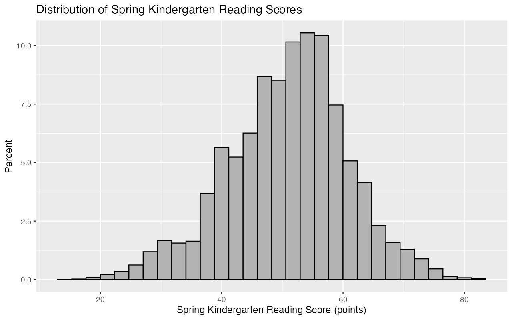
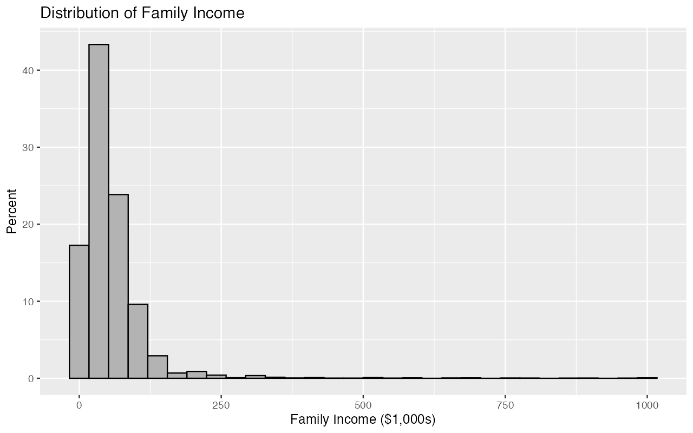
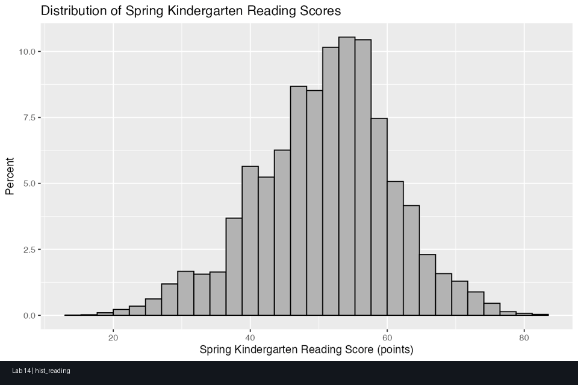

# Lab 14 — Bivariate Regression (ECLS)

> Tight regression workflow, clean tables, and reproducible end-to-end outputs.

## Research Question
How are spring kindergarten reading scores associated with:
1. family income, and
2. number of household members aged under 18?

## Data
- Source: `ecls.rda`
- N (original): 21,260
- N (complete-case analysis set): 17,488
- Dropped for missingness: 3,772

## Primary Source Session
- Authoritative syntax source used most: `LABSESSIONAK_22.Rmd`

## Analyses Implemented
- Variable label extraction via `attributes(ecls)["variable.labels"]`
- Z-standardization of outcome and both predictors
- Income rescaling from dollars to `$1,000s`
- Complete-case subset for analysis variables
- Histograms (percent scale) for reading, income, and household children count
- Two raw bivariate regressions
- Two z-standardized bivariate regressions
- `stargazer` tables for raw and z-standardized model sets
- Textbook interpretation blocks for intercept, slope, and `R^2`
- One-sentence APA write-up including both regressions

## Deliverables
- Key Rmd (Syntax + Output): `lab14_output/lab_14_key.Rmd`
- Key DOCX: `lab14_output/lab_14.docx key.docx`
- Final Rmd: `lab14_output/lab_14_final.Rmd`
- Solution Rmd: `lab14_output/lab_14_solution.Rmd`
- Solution HTML: `lab14_output/lab_14_solution.html`
- Script: `lab14_output/lab_14_script.R`

## Visuals







## Template Check (`style_template2.docx`)
`style_template2.docx` is referenced in legacy/source files (`lab14.rmd`, `LABSESSION_15.Rmd`, `LABSESSION_16.Rmd`, `LABSESSION_20.Rmd`) but is not present in this repo.

For this pipeline, DOCX knitting uses `lab14.docx` as the reference template in `lab14_output/lab_14_key.Rmd`.

## Quick Run
```r
# from Lab14/
source("lab14_output/lab_14_script.R")

rmarkdown::render(
  "lab14_output/lab_14_key.Rmd",
  output_file = "lab_14.docx key.docx",
  output_dir = "lab14_output"
)

rmarkdown::render(
  "lab14_output/lab_14_solution.Rmd",
  output_file = "lab_14_solution.html",
  output_dir = "lab14_output"
)
```
