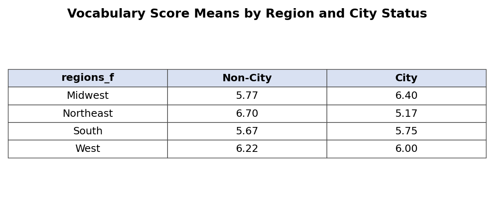

# Lab 08 — WordSum V2 (Two‑Way ANOVA)

> Precision diagnostics. Clean contrasts. Reproducible by design.

## Research Question
Does vocabulary performance (`ws`, 0–10) differ by **city status** (City vs. Non‑City) and **U.S. region** (Midwest, Northeast, South, West), and is the city effect consistent across regions?

## Data + Design
- Dataset: `wordsum v2.sav`
- Outcome: `ws` (vocabulary score)
- Factors: `sized` (City vs. Non‑City), `regions` (4 levels)
- Design: 2 × 4 between‑subjects factorial

## Method Stack
- **Modeling:** `afex` (`aov_car`), `emmeans`
- **Diagnostics:** `pastecs`, `car`, `Rallfun‑v45`
- **Wrangling:** `tidyverse`, `haven`
- **Reporting:** RMarkdown → HTML + DOCX

## Analysis Pipeline (Reproducible)
- **Data prep**: create factor versions of `sized` and `regions`
- **Superfactor**: build 8‑level `regionsize` for diagnostics
- **Diagnostics**: histograms, skewness + Shapiro‑Wilk, Levene’s test, MAD‑Median outliers
- **Model**: two‑way ANOVA (`aov_car`)
- **Follow‑ups**: cell means + marginal means (`emmeans`)
- **Effect size**: partial ω² for each effect

## Repro Steps (Fast Path)
```r
# from lab08/
rmarkdown::render("lab08_output/lab_08_key.Rmd",
                  output_dir = "lab08_output",
                  output_file = "lab_08.docx key.docx")
```

## Visuals

**Interaction Pattern (Cell Means)**


**Excel‑Style Table Snapshot (Q12)**



## Key Results (Omnibus)
- Main effect of city status: **F(1, 312) = 6.19, p = .013, ω²p = 0.016**
- Main effect of region: **F(3, 312) = 3.03, p = .030, ω²p = 0.019**
- Interaction: **F(3, 312) = 18.68, p < .001, ω²p = 0.144**

Interpretation: the city effect changes across regions, so the interaction drives interpretation.

## Deliverables
- **Docx key**: `lab08/lab08_output/lab_08.docx key.docx`
- **RMarkdown key**: `lab08/lab08_output/lab_08_key.Rmd`
- **HTML knit**: `lab08/lab08_output/lab_08_solution.html`
- **Script**: `lab08/lab08_output/lab_08_script.R`

## Code Snippet (Core Model)

```r
ws_anova <- aov_car(ws ~ sized_f * regions_f + Error(id), data = ws)
summary(ws_anova)
ws_anova$Anova
emmeans(ws_anova, ~ sized_f * regions_f)
```

## Repo Notes
- Local dependencies stored in `lab08/rlib/` (ignored by git)
- Wilcox functions: `lab08/Rallfun-v45.txt`

## Changelog
- **2026‑02‑03**: Added full answer key, DOCX replica, embedded Excel‑style table image, and README visuals.
