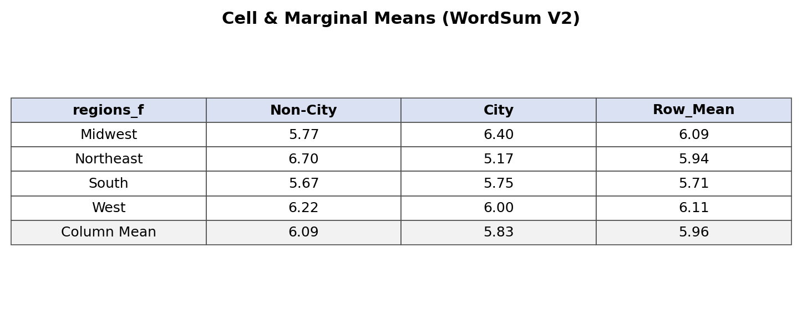
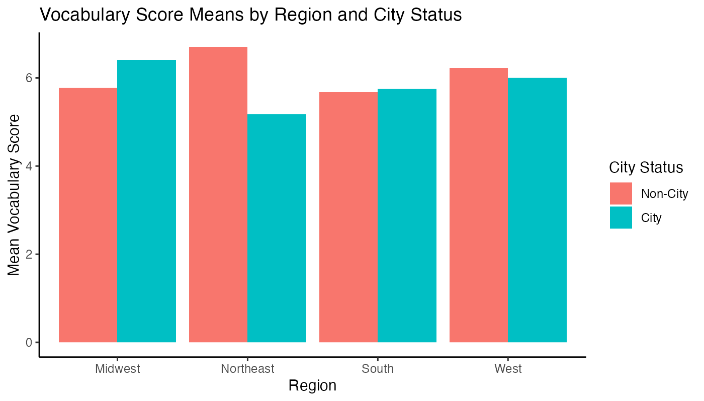

# Lab 09 — WordSum V2 (Contrasts + Follow‑Ups)

> Precision contrasts. Controlled error rates. Reproducible every time.

## Research Question
How do **city status** and **region** shape vocabulary performance, and which specific contrasts survive conservative adjustments?

## Data + Design
- Dataset: `wordsum v2.sav`
- Outcome: `ws` (0–10 vocabulary score)
- Factors: `sized` (City vs Non‑City), `regions` (Midwest, Northeast, South, West)
- Design: 2 × 4 between‑subjects factorial

## Method Stack
- **Modeling:** `afex` (`aov_car`), `emmeans`
- **Diagnostics + Utility:** `Rallfun‑v45`, `pastecs`, `car`
- **Wrangling:** `tidyverse`, `haven`
- **Reporting:** RMarkdown → HTML + DOCX

## Visuals

**Cell & Marginal Means (Excel‑Style Snapshot)**



**Interaction Pattern (Cell Means)**


**Quick Scan GIF**



## Analysis Pipeline
- Create factor + ID variables and verify with two‑way tables
- Run two‑way ANOVA and store `emmGrid` objects
- Tukey‑adjusted pairwise contrasts for region
- Bonferroni‑adjusted city vs non‑city contrasts within each region
- Simple effects of region by city status (Tukey + Bonferroni)
- Complex contrasts (NE vs MW & W) + interaction contrast
- Critical values: Scheffe, Tukey, Bonferroni as required
- Effect sizes: Cohen’s d for all contrasts

## Repro Steps (Fast Path)
```r
# from lab09/
rmarkdown::render("lab09_output/lab_09_key.Rmd",
                  output_dir = "lab09_output",
                  output_file = "lab_09.docx key.docx")
```

## Deliverables
- **Docx key**: `lab09/lab09_output/lab_09.docx key.docx`
- **RMarkdown key**: `lab09/lab09_output/lab_09_key.Rmd`
- **HTML knit**: `lab09/lab09_output/lab_09_solution.html`
- **Script**: `lab09/lab09_output/lab_09_script.R`

## Core Model Snippet

```r
ws_anova <- aov_car(ws ~ sized_f * regions_f + Error(id), data = ws)
summary(ws_anova)
ws_anova$Anova
emmeans(ws_anova, ~ sized_f * regions_f)
```

## Repo Notes
- Local dependencies stored in `lab09/rlib/` (ignored by git)
- Wilcox functions: `lab09/Rallfun-v45.txt`

## Changelog
- **2026‑02‑03**: Full answer key, DOCX replica, tables + visuals, and README.
